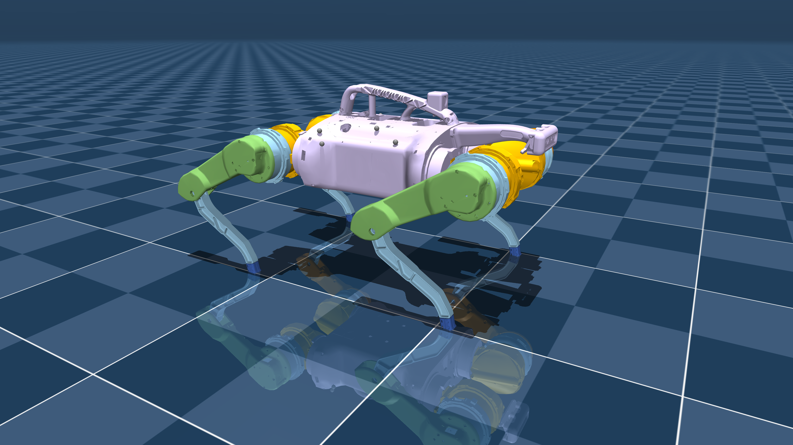

# RAIN-INN LAUTECH Webinar: *What makes up a Robot?*

### Hosted by: **RAIN LAUTECH**
### Speaker: **Bakel Bakel (Aurora Robotics)**

---

## Overview
This repository captures all the **resources, discussions, and visuals** presented during the **RAIN-INN LAUTECH Webinar** titled **“What’s the Robot Made Up Of?”**, delivered by Bakel Bakel.

The session explored **the anatomy of robots** , from sensors and actuators to control systems and AI-driven intelligence , illustrated through real-world case studies and open-source models.

## Watch the recorded session below

**Recorded Session:** [Click here](https://youtu.be/ZsYJNp4bUeI)

📑 **Slides (PDF):** [Click here](slide/RAIN-LAUTECH-BAKEL.pdf)

---

## Topics Covered

### 1. **General Components of a Robot**
- Sensors (Eyes & Perception)
- Actuators (Muscles & Motion)
- Controllers (Brain & Logic)
- Power Systems (Energy Source)
- Communication (Nervous System)
- Structure (Skeleton & Body)

### 2. **Types of Robots Discussed**
- Quadruped Robots 🐾
- Humanoid Robots 🧍‍♂️
- Industrial Robotic Arms 🦾
- Medical Robots ⚕️
- Soft Robots 🧩
- Swarm & Multi-Robot Systems 🚁
- Underwater & Surface Robots 🌊
- Aerial Robots ✈️
- Micro & Nano Robots ⚛️
- Space & Field Robots 🚀

Each category was explained with visuals, URDF/CAD models, and working principles.

# Robots in this repo 

## Some where simulated at the webinar

<table>
 <tr>
    <td> ANYmal B</td>
    <td> ANYmal C (RViz)</td>
    <td> ANYmal C</td>
  </tr><tr>
    <td> ANYmal B (RViz)</td>
    <td> Barkour v0</td>
    <td> Barkour vB</td>
  </tr><tr>
    <td> Flybody (Collision)</td>
    <td> Cassie</td>
    <td> Flybody</td>  
  </tr><tr>
    <td> G1</td>
     <td> Apptronik Apollo</td>
     <td> Multi-Robot</td>
  </tr><tr>
    <td> Go2</td>
    <td> Perseverance</td>
    <td> Robot Soccer Kit</td>
  </tr><tr>
    <td> Shadow Hand</td>
    <td> SoftFoot</td>
    <td> Spot</td>
  </tr><tr>
    <td> TIAGo Dual</td>
    <td> TidyBot</td>
    <td> UMI Gripper</td>
  </tr> <tr>
    <td> ALOHA Wrist</td>
    <td> ALOHA</td>
  </tr><tr>
    <td> X2</td>
    <td> cf2</td>
    <td> D435i</td>
    <td></td><td></td>
  </tr>
</table>

---

#

## Related Repositories & References

Below are repositories and resources that were referenced or used to demonstrate robot models, control, and simulation:

| **Repo / Resource** | **Description** |
|----------------------|-----------------|
| [Aurora Robotics](https://github.com/Bakel-Bakel) | Home repository for Bakel Bakel’s robotics projects |
| [Aurora Robotics Arm Project](https://github.com/Bakel-Bakel/aurora-task-4) | Custom robotic arm model and control code |
| [Unitree SDK2](https://github.com/unitreerobotics) | API and SDK for Unitree Quadruped Robots |
| [MuJoCo Menagerie](https://github.com/google-deepmind/mujoco_menagerie) | Collection of open-source robot models for MuJoCo |
| [ROS 2 Tutorials](https://docs.ros.org/en/rolling/Tutorials.html) | Official ROS 2 documentation |
| [Gym Pybullet Drones](https://github.com/utiasDSL/gym-pybullet-drones/tree/master) | Gym Pybullet Drones Repo |

## Acknowledgments

Special thanks to:
- **RAIN LAUTECH** , for hosting the webinar.  
- **Aurora Robotics** , for supporting research and content.  
- All participants who joined the live session and contributed to discussions.  

---

## 🧭 Contact

For collaboration, mentorship, or research discussions:  
📧 **begededum4bakel@gmail.com**  
🌐 [**LinkedIn – Bakel Bakel**](https://www.linkedin.com/in/bakel-bakel-6341a7150/)  
🏢 [**Aurora Robotics**](https://www.linkedin.com/company/aurora-robotics-in/)

---

**“Move with Intent, Leave Nothing to Chance”**  
– *Bakel Bakel* 🚀
